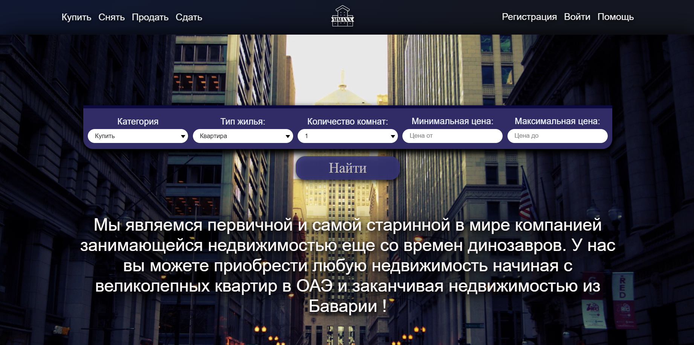
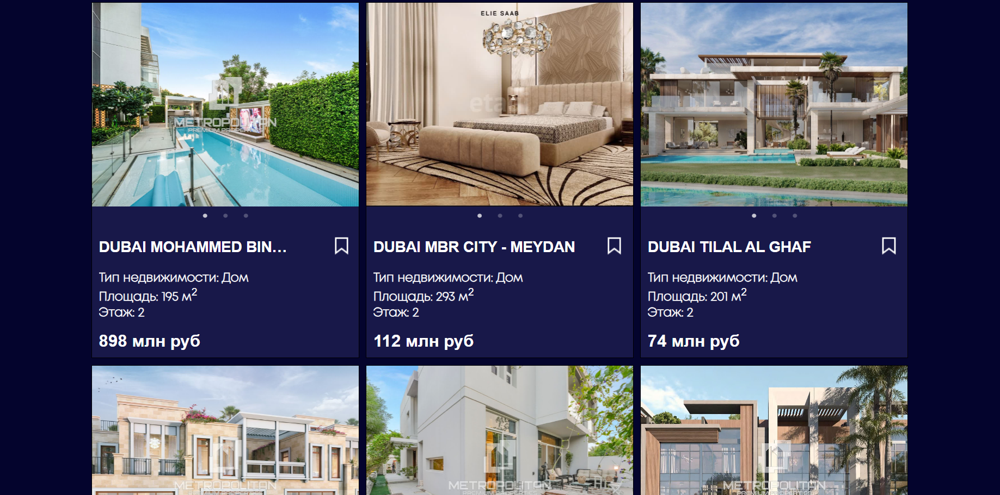

<h1>Агенство недвижимости</h1>
 
<h3>Платформа помогает в поиске недвижимости и в сопровождении сделки</h3>

<h1>Фукнциональность</h1>
 
<li>Авторизация</li>
<li>Сортировка по входным данным</li>
<li>Просмотр всех объектов</li>
<li>Добавление недвижимости и размещение его на платформе</li>
<li>Добавление комментариев</li>
<li>Онлайн чат в реайльном времени</li>
<li>Отравка формы в поддержку</li>

<h1>Стек проекта</h1>
 
<li>React / React Redux</li>
<li>React router</li>
<li>Redux / Redux Thunk</li>
<li>bootstrap</li>
<li>React Bootstrap</li>
<li>MUI</li>
<li>Node js</li>
<li>Express</li>
<li>mongoose</li>
<li>multer</li>

<h1>Команда</h1>
 
<li><a>https://github.com/</a></li>
<li><a>https://github.com/Malik-270</a></li>
<li><a>https://github.com/xalidd</a></li>
<li><a>https://github.com/MSiriev</a></li>